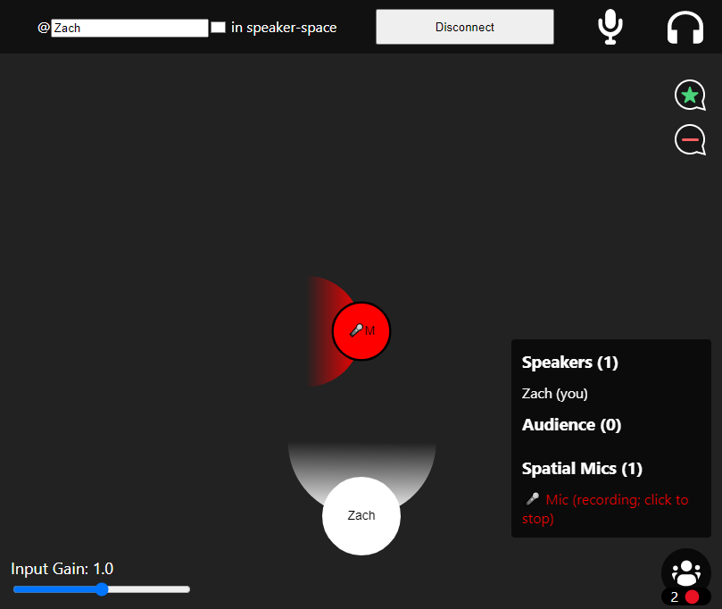

# Spatial Microphone
This is a "virtual microphone" that runs on the command line. Drop the Spatial Microphone in a High Fidelity Spatial Audio Space to record the audio in that Space from coordinates `(0, 0, 0)`. The Spatial Microphone saves audio recordings in `.wav` format by default. Developers can change that with a quick source code update such that the Microphone records in `.mp3` format. Audio output files are saved to disk in the `output` directory.

Spatial Microphone works out-of-the-box with the [Spatial Speaker Space Experiment](../Spatial-Speaker-Space), as displayed in the screenshot below.

## Author
Zach Fox

## Usage
1. Install [NodeJS v14.15.x](https://nodejs.org/en/)
2. Run `npm install`
3. Copy `auth.example.json` to `auth.json`.
4. Populate your credentials inside `./auth.json`.
    - Obtain `HIFI_*` credentials from the [High Fidelity Spatial Audio API Developer Console](https://account.highfidelity.com/dev/account)
5. Run `npm run start`

### Manually Starting and Stopping Recording
Make one of the following WebSocket requests to `http://localhost:8124/spatial-microphone/socket.io`:
- `"startRecording"`
    - Starts recording audio.
- `"finishRecording"`
    - Stops recording audio and saves the current recording to disk.
- `"toggleRecording"`
    - If currently recording audio, stops recording audio. Otherwise, starts recording audio.

### Programmatically Starting and Stopping Recording with Spatial Speaker Space
1. Start up the [Spatial Speaker Space Experiment](../Spatial-Speaker-Space) using the instructions found underneath that Experiment.
2. Start up Spatial Microphone using the Usage instructions above, ensuring that the Space to which the Microphone connects matches the Spatial Speaker Space to which you are connecting in your browser.
3. Connect to the Spatial Speaker Space using your browser.
4. You should see the Spatial Microphone in the center of the virtual space. Click the Participants Floating Action Button in the bottom right, then click on the Spatial Mic's display name in the list to start recording. Click the Spatial Mic's display name again to stop recording.